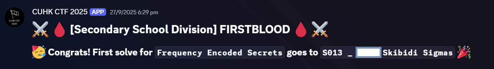

# Frequency Encoded Secrets
Decided to do a write-up for this since it's my first blood in my first ever CTF comp!

  


<details>
<summary>Click to see something sigma!</summary>



</details>


## Details:
* Author:  rain251
* Category: Forensics
* Difficulty: ★★★☆
* Score Acquired: 457

## Description:
Beep, Beeeeep, BepBepBep... It sounds like a telegraph...

[Link to the challenge](https://25.cuhkctf.org/challenges#Frequency%20Encoded%20Secrets-19)

[Challenge File](files/frequency_encoded_secrets.zip)

## Write-up:
We were given a zip file which contained an audio file

This is the wav file:
  

At first, I thought it was morse code lol

But then I decided to put it into Audacity since it was a forensics challenge and I remember watching a video about hidden messages in audio files.

## My Solution:
>Once inside Audacity, the audio file seemed like an average audio file, nothing special.  
  

>Then, I clicked the three dots on the track and changed it from Waveform to Spectrogram
  

>After changing it to Spectrogram, I enlarged the track since I'm kinda blind. From then, I could clearly see there was 2 frequencies that kept appearing, 500hz and 1000hz.


>It was clear to me that it was binary and that 1000hz was 1 and 500hz was 0. In order to confirm that, I used AI to write a Python script which could identify the 500hz as 0 and 100hz as 1.
<details>
<summary>Click for the script</summary>

```
import numpy as np
import soundfile as sf

def get_dominant_freq(chunk, samplerate):
    # FFT
    fft = np.fft.rfft(chunk)
    freqs = np.fft.rfftfreq(len(chunk), 1/samplerate)
    idx = np.argmax(np.abs(fft))
    return freqs[idx]

def decode_bits_from_audio(filename, bit_duration=0.05, f0=500, f1=1000, threshold=250):
    # Read audio
    data, samplerate = sf.read(filename)
    if data.ndim > 1:
        data = data[:, 0]  # Use first channel if stereo

    samples_per_bit = int(bit_duration * samplerate)
    num_bits = len(data) // samples_per_bit

    bits = []
    for i in range(num_bits):
        chunk = data[i*samples_per_bit:(i+1)*samples_per_bit]
        if len(chunk) < samples_per_bit:
            break
        freq = get_dominant_freq(chunk, samplerate)
        # Decide bit value based on which frequency it's closer to
        if abs(freq - f0) < abs(freq - f1):
            bits.append('0')
        else:
            bits.append('1')
        # Optional: print or debug
        # print(f"Chunk {i}: Dominant freq = {freq:.1f} Hz, Bit = {bits[-1]}")
    return ''.join(bits)

if __name__ == "__main__":
    filename = "input.wav"  # Replace with your audio file
    bitstream = decode_bits_from_audio(filename)
    print("Decoded bits:", bitstream)
```

</details>
>After running the code, I put the binary numbers into [CyberChef](https://gchq.github.io/CyberChef)
 and got the flag!


## Conclusion:
I had a lot of fun doing this chal and would love to see something similar again next year! Did not expect to blood this! :D

