# The Files
Is this related to THE files? 👀 Let's find out together

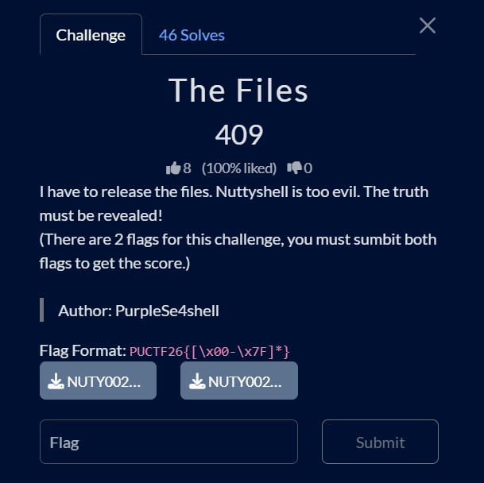  

## Details:
* Author: PurpleSe4shell
* Category: Forensics
* Solves: 46
* Score Acquired: 409

## Description:
I have to release the files. Nuttyshell is too evil. The truth must be revealed!
(There are 2 flags for this challenge, you must submit both flags to get the score.)

[Link to the challenge](https://ctf.polyuctf.com/challenges?#The%20Files-57)

[Challenge Files](../files/NUTY00200195.pdf)

## Analysis:
We are given 2 files, each file contains a part of the flag.

Before downloading the pdf, I was already anticipating something that was like the actual ███████ files. (iykyk)

## My solution:

### Part One

>This is the PDF:
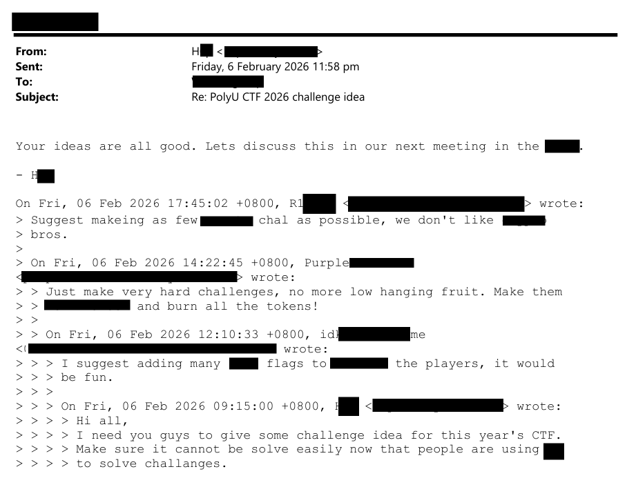

### Step 1: Inspect the PDF
Upon opening the pdf, you will see black boxes, just like the ACTUAL files.

My first instinct was to copy the text by selecting it. However, the pdf viewer I used did not allow me to do so.

### Step 2: Switch PDF Tool
Then, I switched to Neat Office as that app allowed me to edit PDFs for free (not an ad btw)

>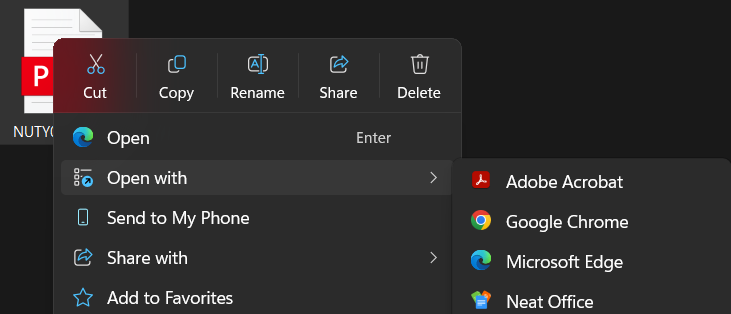

### Step 3: Remove Black Boxes
Afterwards, I tried to select the text. But instead of selecting it, I accidentally moved the black box.

>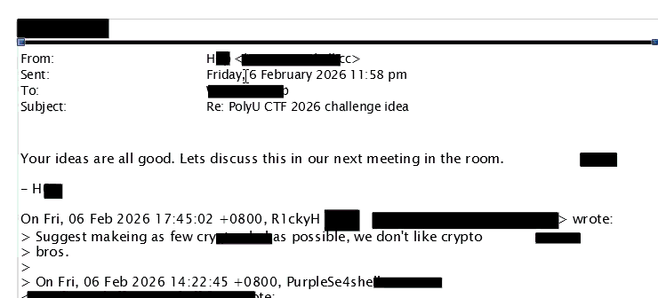

So I simply deleted all the black boxes, revealing the first flag.

>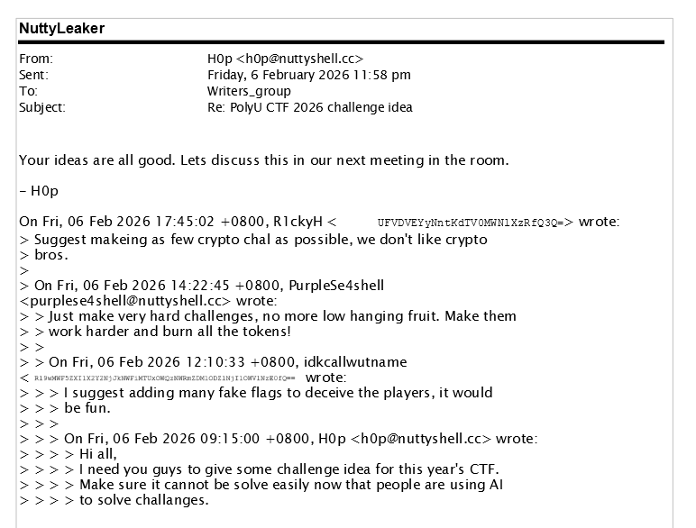

### Step 4: Identify Encoding
Wait! This isn't the flag. This string looks like Base64. Let's decode it.

So I copied the text and found that the top one is  
`UFVDVEYyNntKdTV0MWNlXzRfQ3Q=`

However, I can't copy the second one.

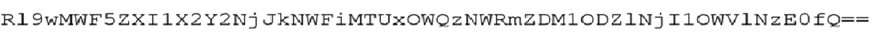

Oh, it's an image. Let me just use the scan text function in Windows Photos.

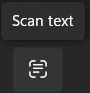

### Step 5: Extract Hidden Text (OCR)
Through this, I found the second part to be  
`R19wMWF5ZXI1X2Y2NjJkNWFiMTUxOWQzNWRmZDM1ODZ1NjI1OWV1NzE0fQ ==`

### Step 6: Decode Base64
Time to decode both of them!

- First part:  
`PUCTF26{Ju5t1ce_4_Ct`

- Second part:  
`G_p1ayer5_f662d5ab1519d35dfd3586u6259eu714}`

### Step 7: Debug Incorrect Flag
Oh no! The flag is incorrect 😭 Hmm, which part went wrong?

Let's look at the flag: the first part is directly copied from the text box, so it can't be wrong. However, the second part seems a bit weird.

When you combine both parts, you get `CtG`. This doesn't make sense in the context of a CTF flag format, which suggests an error in the second part.

### Step 8: Fix OCR Mistake
Let me read the image again and see if OCR messed something up.

*After staring at the image for a while and not finding the error, I decided to just type it out myself.*

OCR did mess up, but at last, I was able to get:

```
PUCTF26{Ju5t1ce_4_CtF_p1ayer5_f662d5ab1519d35dfd3586e6259ee714}
```

which is correct!

---

### Part Two

>This is the image
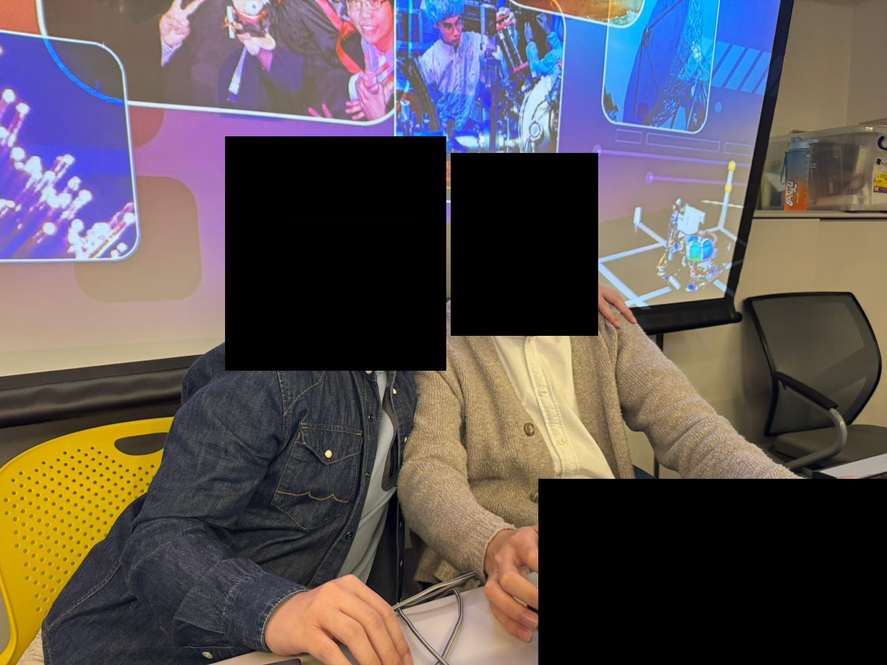

### Step 1: Check Metadata
Let me try looking at the properties of this image.

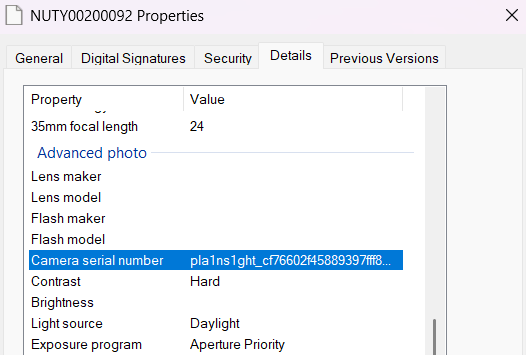

Nice! The second part of the second flag is in the camera serial number:

```
pla1ns1ght_cf76602f45889397fff8ebd94e67497f}
```

### Step 2: Analyze Image Content
Now, I have to find the first part of the flag.

Hmm, the black boxes in the image look interesting.

### Step 3: Use Image Forensics Tool
I used an image forensics tool (forensic magnifier) to inspect hidden/obscured regions, which can reveal details not visible normally.

The first result I got was:
https://29a.ch/photo-forensics/#forensic-magnifier


### Step 4: Recover Hidden Data
Jackpot! I got the first part of the flag:

```
PUCTF26{Th3_fl4g_1s_h1dd3n_in_
```

### Step 5: Combine Flag Parts
By combining the two, you get:

```
PUCTF26{Th3_fl4g_1s_h1dd3n_in_pla1ns1ght_cf76602f45889397fff8ebd94e67497f}
```

which is the final flag needed to solve the challenge!


## Conclusion:
Overall a pretty fun challenge which wasn't too hard but also not too easy.

I learned a lot from this challenge, especially when it comes to working with PDFs, spotting OCR mistakes, and using image forensics tools. It also showed me how important it is to double-check results instead of relying heavily on automated tools.

Would recommend for beginners!

Besides, I loved the theme of this challenge a lot as I found it quite funny and mirrors the recently surfaced files from a high-profile investigation, making it even more fun to play! :>

---

<details><summary>Here's something special since you read until the end</summary>

This is the convo I had with my teammates trying to get the first flag🥀 Pls dont look at the timestamp...

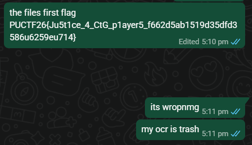
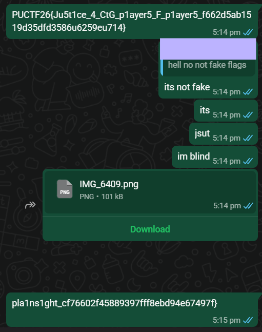
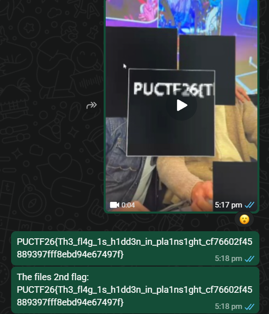
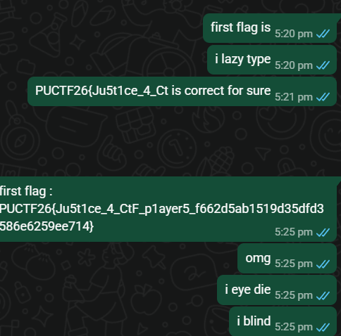

</details>
